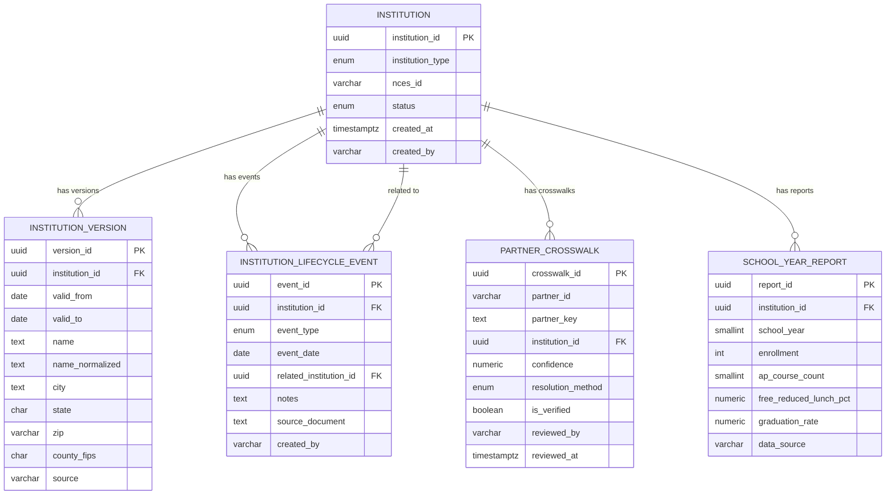
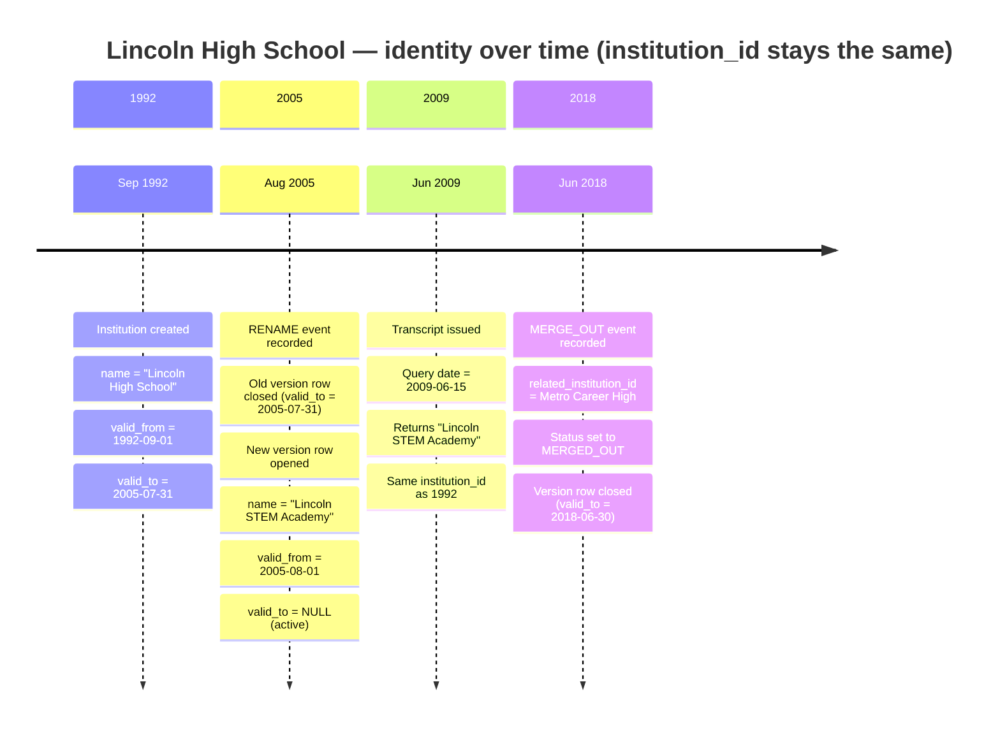
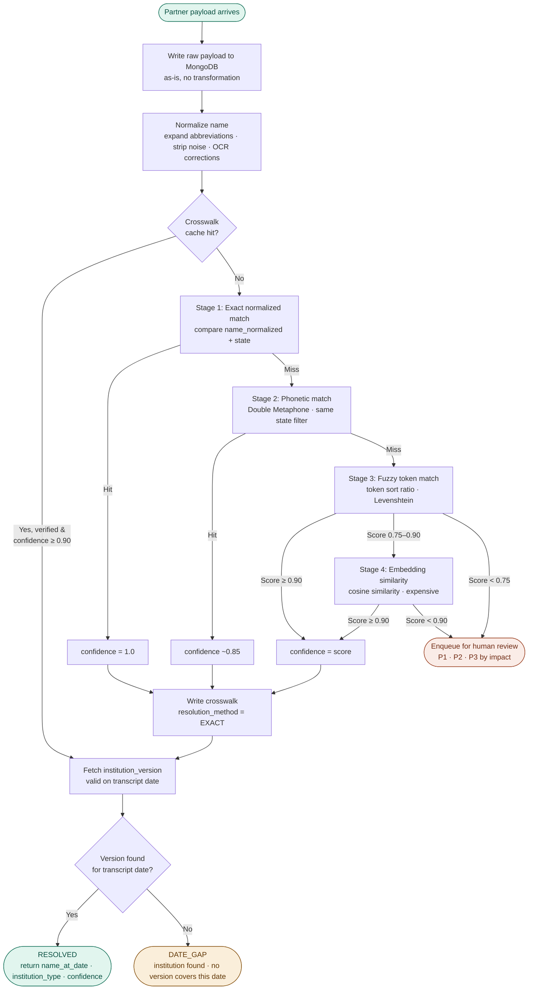

# Diagrams

Three diagrams illustrating the data model, lifecycle, and resolution flow.
All diagrams render natively in GitHub.

---

## 1. Entity relationship overview

Six tables in PostgreSQL. `institution` is the stable center — everything else references it.

---

## 2. Bitemporal lifecycle — institution identity over time

How a single institution moves through rename and merge events while keeping the same `institution_id`.

---

## 3. Transcript resolution flow

How a raw partner payload moves through the system to a resolved canonical institution record.

---

## Key design notes

**Why `institution_id` never changes**
A rename is just a new `institution_version` row — the ID stays the same. Partner crosswalks, school reports, and transcript records all continue to reference the same ID without any migration.

**Why the crosswalk is checked first**
Once a partner key has been resolved and verified, re-running the full matching pipeline is wasteful. The crosswalk acts as a cache — the matching pipeline only runs on first encounter or after a partner correction.

**Why MongoDB for staging**
Raw partner payloads arrive in unpredictable shapes. Writing them to MongoDB before normalization preserves the original data for audit and gives the pipeline flexibility to handle any incoming shape without corrupting canonical PostgreSQL records.
